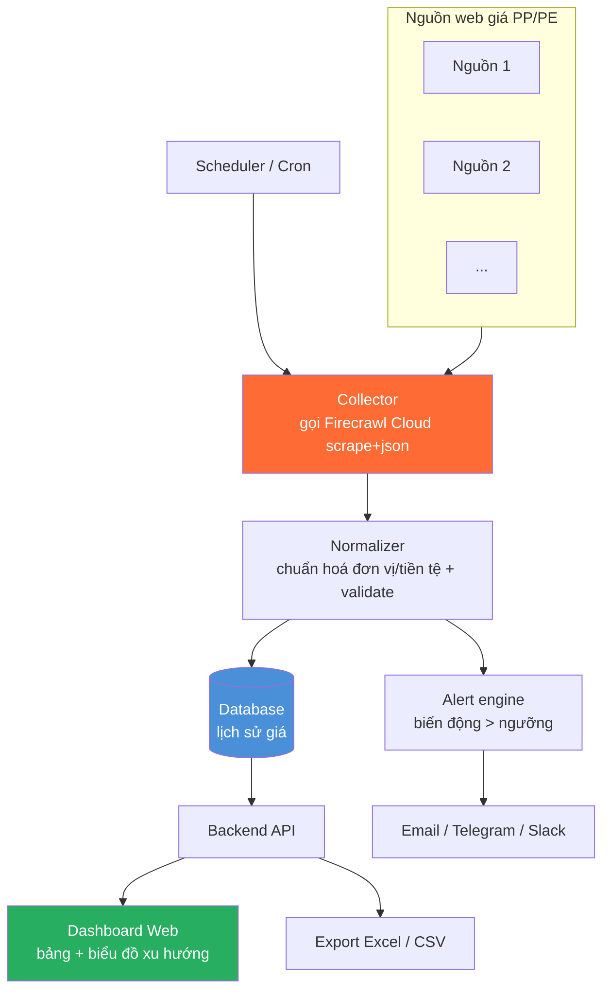

# Kế hoạch sản phẩm & bàn giao — Hệ thống theo dõi giá nhựa nguyên sinh PP/PE

> Tài liệu kế hoạch (PRD + lộ trình triển khai). Mục tiêu: biến công cụ mẫu
> `plastic-resin-price-scraper` thành **sản phẩm hoàn chỉnh, đóng gói, bàn giao đưa vào sử dụng**,
> với đầu ra cuối là **Dashboard web** theo dõi giá PP/PE.
>
> Trạng thái: 📄 Kế hoạch — chưa triển khai code (ngoài bản CLI mẫu đã có).

---

## 1. Mục tiêu & phạm vi

### Mục tiêu
Tự động thu thập **giá resin nhựa nguyên sinh PP, PE** (giá quốc tế / chỉ số) theo lịch, lưu lịch sử,
hiển thị trên **dashboard web** với biểu đồ xu hướng, và cảnh báo khi giá biến động mạnh.

### Trong phạm vi
- Cào & trích xuất giá PP/PE/HDPE/LDPE/LLDPE từ các nguồn web cấu hình được.
- Chuẩn hoá đơn vị/tiền tệ, lưu lịch sử, dedup.
- Dashboard web: bảng giá hiện tại + biểu đồ xu hướng + lọc theo loại nhựa/khu vực/nguồn.
- Lập lịch tự động + cảnh báo biến động.
- Đóng gói Docker, tài liệu vận hành, nghiệm thu.

### Ngoài phạm vi (giai đoạn này)
- Self-host toàn bộ Firecrawl (dùng **Firecrawl Cloud** qua API key).
- Dự báo giá bằng ML, đàm phán/mua hàng tự động.
- Phân quyền người dùng phức tạp (chỉ cần đăng nhập cơ bản nếu công khai ra internet).

---

## 2. Kiến trúc đề xuất



### Thành phần
| Thành phần | Vai trò | Đề xuất công nghệ |
|------------|---------|-------------------|
| **Collector** | Gọi Firecrawl, lấy giá thô | Python (tái dùng script đã có) |
| **Normalizer** | Chuẩn hoá đơn vị/tiền tệ, validate, dedup | Python |
| **Database** | Lưu lịch sử giá | PostgreSQL (hoặc SQLite nếu đơn lẻ) |
| **Scheduler** | Chạy collector theo lịch | Cron trong container / APScheduler |
| **Backend API** | Cấp dữ liệu cho dashboard, export | FastAPI |
| **Dashboard Web** | Bảng giá + biểu đồ xu hướng | React + Recharts *hoặc* Streamlit (nhanh hơn) |
| **Alert engine** | Phát hiện biến động, gửi thông báo | Python + webhook/SMTP |

> **Gợi ý cân nhắc**: nếu ưu tiên **bàn giao nhanh**, dùng **Streamlit** cho dashboard (1 ngôn ngữ
> Python, ít code). Nếu cần **giao diện chỉn chu/tuỳ biến cao**, dùng **React + FastAPI**.

---

## 3. Mô hình dữ liệu (đề xuất)

```sql
-- Nguồn dữ liệu
CREATE TABLE sources (
    id          SERIAL PRIMARY KEY,
    name        TEXT UNIQUE NOT NULL,
    url         TEXT NOT NULL,
    material    TEXT,              -- PP/PE...
    enabled     BOOLEAN DEFAULT true
);

-- Bản ghi giá (lịch sử)
CREATE TABLE prices (
    id              SERIAL PRIMARY KEY,
    source_id       INT REFERENCES sources(id),
    material        TEXT NOT NULL,         -- PP/PE/HDPE/LDPE/LLDPE
    grade           TEXT,
    price_raw       NUMERIC,               -- giá gốc như cào được
    currency_raw    TEXT,
    unit_raw        TEXT,
    price_usd_ton   NUMERIC,               -- giá đã chuẩn hoá về USD/tấn
    region          TEXT,
    price_date      DATE,                  -- ngày/kỳ của giá
    scraped_at      TIMESTAMPTZ NOT NULL,
    UNIQUE (source_id, material, grade, region, price_date)  -- dedup
);

-- Cấu hình cảnh báo
CREATE TABLE alerts (
    id              SERIAL PRIMARY KEY,
    material        TEXT,
    threshold_pct   NUMERIC,               -- vd 5 = cảnh báo khi đổi > 5%
    channel         TEXT,                  -- email/telegram/slack
    target          TEXT                   -- địa chỉ nhận
);
```

---

## 4. Lộ trình triển khai (theo Sprint)

### Sprint 0 — Chuẩn bị (0.5 ngày)
- [ ] Chốt **danh sách nguồn** giá PP/PE chính thức (URL thật).
- [ ] Kiểm tra **robots.txt / ToS** từng nguồn; lập bảng "được phép / cần xin phép".
- [ ] Lấy **Firecrawl API key**, ước lượng credit/tháng theo số nguồn × tần suất.
- [ ] Chốt công nghệ dashboard (Streamlit vs React+FastAPI).

### Sprint 1 — Lõi dữ liệu (2–3 ngày)
- [ ] Module **Normalizer**: chuẩn hoá đơn vị (USD/lb, USD/kg → USD/tấn), tiền tệ (tỉ giá), validate.
- [ ] **Database** + schema ở mục 3; migration.
- [ ] Collector ghi vào DB thay vì chỉ CSV; **dedup**.
- [ ] Unit test cho chuẩn hoá & dedup.

### Sprint 2 — Tự động hoá (1–2 ngày)
- [ ] **Scheduler** (cron/APScheduler) chạy collector theo lịch cấu hình.
- [ ] **Retry** + log có cấu trúc + xử lý nguồn lỗi không làm hỏng toàn bộ run.
- [ ] **Alert engine**: so kỳ trước, gửi thông báo khi vượt ngưỡng.

### Sprint 3 — Dashboard web (3–4 ngày)
- [ ] **Backend API**: endpoint lấy giá hiện tại, lịch sử, export.
- [ ] **Dashboard**:
  - [ ] Bảng giá hiện tại (lọc theo loại nhựa/khu vực/nguồn).
  - [ ] **Biểu đồ xu hướng** giá theo thời gian (PP vs PE).
  - [ ] So sánh nguồn; đánh dấu biến động mạnh.
  - [ ] Nút **export Excel/CSV**.
- [ ] (Tuỳ chọn) đăng nhập cơ bản nếu mở ra internet.

### Sprint 4 — Đóng gói & bàn giao (1–2 ngày)
- [ ] **Dockerfile** cho từng service + **docker-compose** (app + DB + dashboard).
- [ ] Cấu hình tập trung qua **`.env`** (API key, nguồn, lịch, ngưỡng cảnh báo, SMTP/Telegram).
- [ ] Pin phiên bản dependencies.
- [ ] **Tài liệu**: README cài đặt + **Runbook** vận hành + sơ đồ kiến trúc.
- [ ] **Nghiệm thu** theo Definition of Done (mục 6).

> Tổng ước lượng: **~8–12 ngày công** cho bản đầy đủ có dashboard (tuỳ chọn công nghệ).
> Bản Streamlit có thể rút ngắn Sprint 3 còn ~1–2 ngày.

---

## 5. Đóng gói & cấu hình bàn giao

Cấu trúc thư mục mục tiêu:
```
plastic-resin-price-tracker/
├── docker-compose.yml          # app + db + dashboard
├── .env.example                # API key, lịch, ngưỡng, kênh cảnh báo
├── collector/                  # Firecrawl scrape + normalize + ghi DB
├── api/                        # FastAPI backend
├── dashboard/                  # web UI (React/Streamlit)
├── db/                         # migration / schema
├── sources.json                # cấu hình nguồn
└── docs/
    ├── README.md               # cài đặt & chạy
    ├── RUNBOOK.md              # vận hành, xử lý sự cố, thêm nguồn
    └── LEGAL.md               # robots.txt/ToS từng nguồn
```

Chạy bàn giao:
```bash
cp .env.example .env   # điền FIRECRAWL_API_KEY + cấu hình
docker compose up -d   # chạy toàn bộ: cào theo lịch + dashboard
```

---

## 6. Definition of Done (tiêu chí nghiệm thu)

1. ✅ `docker compose up -d` chạy được toàn hệ thống, **tự động cào giá PP/PE theo lịch** không cần thao tác tay.
2. ✅ Dữ liệu lưu DB; **truy xuất lịch sử ≥ 4 tuần**; không trùng lặp.
3. ✅ **Dashboard web** hiển thị bảng giá hiện tại + **biểu đồ xu hướng**, lọc được theo loại nhựa/khu vực/nguồn.
4. ✅ **Export Excel/CSV** đúng định dạng phòng mua hàng cần.
5. ✅ **Cảnh báo** gửi đúng khi giá biến động vượt ngưỡng cấu hình.
6. ✅ Có **README + Runbook**; người vận hành khác tự thêm/bớt nguồn được mà không cần lập trình viên.
7. ✅ Đã kiểm tra **pháp lý** cho từng nguồn dữ liệu.

---

## 7. Rủi ro & giảm thiểu

| Rủi ro | Ảnh hưởng | Giảm thiểu |
|--------|-----------|------------|
| Nguồn đổi layout / chặn bot | Mất dữ liệu | Firecrawl fire-engine + prompt LLM (bền với đổi layout); alert khi nguồn trả 0 dòng |
| Giá nằm sau đăng nhập/trả phí | Không lấy được | Chốt nguồn công khai ở Sprint 0; dùng `actions`/headers nếu được phép |
| Vấn đề pháp lý/ToS | Rủi ro tuân thủ | LEGAL.md + chỉ dùng nguồn được phép |
| Chi phí Firecrawl credit tăng | Chi phí vận hành | Dùng `maxAge` cache; giảm tần suất; gộp nguồn |
| Sai số chuẩn hoá đơn vị/tỉ giá | Số liệu lệch | Unit test chuẩn hoá; nguồn tỉ giá tin cậy; lưu cả giá gốc lẫn giá chuẩn hoá |

---

## 8. Việc cần bạn quyết / cung cấp trước khi build

1. **Danh sách URL nguồn giá chính thức** (PP/PE) muốn theo dõi.
2. Chọn **công nghệ dashboard**: Streamlit (nhanh) hay React+FastAPI (chỉn chu).
3. **Kênh cảnh báo**: Email / Telegram / Slack?
4. Dashboard chạy **nội bộ (LAN)** hay **mở ra internet** (cần đăng nhập)?
5. **Tần suất cào** (hằng ngày / hằng tuần?) và **ngưỡng cảnh báo** (% biến động).
6. Có cần quy đổi **USD → VND** trong báo cáo không?

> Khi bạn trả lời các mục trên, tôi sẽ bắt đầu triển khai theo lộ trình (Sprint 1 trở đi) và
> cập nhật vào cùng PR.
