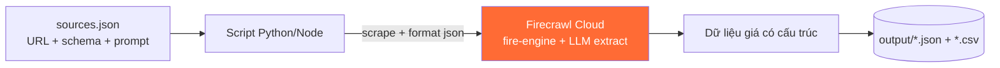

# Cào giá nguyên vật liệu nhựa nguyên sinh PP / PE

Công cụ mẫu dùng **Firecrawl Cloud** để cào & trích xuất **giá resin nhựa nguyên sinh PP, PE**
(giá quốc tế / chỉ số) từ các trang web, xuất ra **JSON + CSV**.

Có sẵn **hai bản**: Python và Node.js — chọn bản nào tuỳ bạn, cả hai dùng chung file cấu hình
[`sources.json`](./sources.json).

## Cách hoạt động



Mỗi nguồn được gọi qua endpoint `scrape` với `format = json` kèm **JSON schema**, nên Firecrawl
tự render JS, vượt antibot (fire-engine) và dùng LLM bóc đúng các trường giá bạn cần.

## Yêu cầu

- Một **Firecrawl API key** (đăng ký tại <https://www.firecrawl.dev>).
- Python ≥ 3.9 **hoặc** Node.js ≥ 18.

```bash
cp .env.example .env      # rồi điền FIRECRAWL_API_KEY
export FIRECRAWL_API_KEY=fc-...   # hoặc set trực tiếp
```

## Chạy bản Python

```bash
cd python
pip install -r requirements.txt
python scrape_resin_prices.py
```

## Chạy bản Node.js

```bash
cd node
npm install
npm start
```

Kết quả ghi vào `output/resin_prices_<timestamp>.json` và `.csv`.

## Cấu hình nguồn — `sources.json`

```jsonc
{
  "scrape": { "onlyMainContent": true, "timeoutMs": 60000, "maxAgeMs": 3600000 },
  "schema": { /* JSON schema cho cac truong gia */ },
  "sources": [
    {
      "name": "businessanalytiq-polypropylene",
      "material": "PP",
      "enabled": true,                 // bat/tat nguon
      "url": "https://.../polypropylene-price-index/",
      "prompt": "Trich xuat tat ca gia PP ..."   // huong dan cho LLM (tuy chon)
    }
  ]
}
```

- **Thêm nguồn**: copy một block trong `sources`, đổi `name`/`url`/`material`/`prompt`.
- **Bật/tắt** nhanh bằng `enabled: true|false` (2 nguồn `chemanalyst-*` đang tắt sẵn làm ví dụ).
- **Đổi trường lấy ra**: sửa `schema` — cả hai script đều đọc chung schema này.

### Các trường được trích xuất

| Trường | Ý nghĩa |
|--------|---------|
| `material` | PP / PE / HDPE / LDPE / LLDPE |
| `grade` | Mã grade (homopolymer, film, injection...) |
| `price` | Giá trị số |
| `currency` | USD / EUR / CNY / VND... |
| `unit` | USD/ton, USD/lb, USD/kg... |
| `region` | US / Europe / China / SEA... |
| `date` | Ngày/kỳ của giá |
| `change` | Biến động so với kỳ trước |

## Cào định kỳ (theo dõi biến động giá)

Lên lịch chạy script bằng `cron` (giá resin thường cập nhật theo tuần):

```cron
# 7h sáng thứ Hai hàng tuần
0 7 * * 1  cd /path/to/plastic-resin-price-scraper/python && FIRECRAWL_API_KEY=fc-... python scrape_resin_prices.py
```

Mỗi lần chạy tạo một file timestamp riêng → ghép lại để dựng lịch sử giá / biểu đồ xu hướng.

> Muốn theo dõi tự động + cảnh báo email khi giá đổi, có thể dùng endpoint **`monitor`** của
> Firecrawl thay cho cron (xem `apps/api/src/controllers/v2/monitor.ts`).

## Lưu ý

- **Nguồn mẫu chỉ để minh hoạ.** Hãy kiểm tra `robots.txt` và điều khoản sử dụng của từng
  trang trước khi cào; thay bằng nguồn bạn được phép dùng.
- Nếu một trang **trả về 0 dòng giá**: thử chỉnh `prompt` cho rõ hơn, hoặc kiểm tra trang có
  thực sự hiển thị bảng giá công khai không (nhiều site giá nằm sau đăng nhập/trả phí).
- `maxAgeMs` cho phép Firecrawl dùng lại cache (mặc định 1 giờ) để tiết kiệm credit khi chạy lại.
