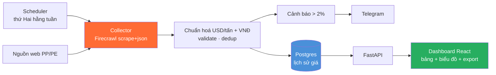

# Hệ thống theo dõi giá nhựa nguyên sinh PP / PE

Sản phẩm hoàn chỉnh, đóng gói bằng Docker: tự động **cào giá PP/PE** (giá quốc tế/chỉ số) qua
**Firecrawl Cloud** mỗi tuần, **chuẩn hoá USD/tấn + quy đổi VNĐ**, lưu lịch sử vào Postgres, hiển thị
trên **dashboard web (React)** và **cảnh báo Telegram** khi giá biến động > ngưỡng (mặc định 2%).

## Kiến trúc



| Service | Mô tả | Cổng |
|---------|-------|------|
| `db` | PostgreSQL 16, tự khởi tạo schema | 5432 (nội bộ) |
| `collector` | Cào + chuẩn hoá + lưu DB + cảnh báo, lập lịch tuần | — |
| `api` | FastAPI cấp dữ liệu + export Excel/CSV | 8000 (nội bộ) |
| `dashboard` | React (nginx) + proxy `/api` | `8080` (ra ngoài) |

## Cài đặt & chạy

Yêu cầu: **Docker + Docker Compose**.

```bash
cd examples/plastic-resin-price-tracker
cp .env.example .env
# Sửa .env: điền FIRECRAWL_API_KEY, đổi POSTGRES_PASSWORD,
#           (tuỳ chọn) TELEGRAM_BOT_TOKEN + TELEGRAM_CHAT_ID, API_TOKEN
docker compose up -d --build
```

- Mở dashboard: **http://localhost:8080**
- Thu thập ngay lần đầu (không chờ tới thứ Hai): đặt `RUN_ON_START=true` trong `.env`, hoặc:
  ```bash
  docker compose run --rm collector python run.py
  ```

## Cấu hình chính (`.env`)

| Biến | Ý nghĩa | Mặc định |
|------|---------|----------|
| `FIRECRAWL_API_KEY` | Key Firecrawl Cloud | (bắt buộc) |
| `FX_USD_VND_FALLBACK` | Tỉ giá dự phòng khi API tỉ giá lỗi | 25400 |
| `ALERT_THRESHOLD_PCT` | Ngưỡng % cảnh báo biến động | 2 |
| `TELEGRAM_BOT_TOKEN` / `TELEGRAM_CHAT_ID` | Kênh cảnh báo | (trống = tắt) |
| `SCHEDULE_DAY_OF_WEEK/HOUR/MINUTE/TZ` | Lịch chạy | `mon` 07:00 `Asia/Ho_Chi_Minh` |
| `API_TOKEN` | Bảo vệ API khi mở internet (header `X-API-Token`) | (trống = mở) |
| `DASHBOARD_PORT` | Cổng dashboard | 8080 |

## Nguồn dữ liệu — `sources.json`

Bật/tắt bằng `enabled`, thêm nguồn bằng cách copy một block và đổi `url`/`material`/`prompt`.
Schema trích xuất dùng chung ở cùng file.

## Phát triển (không Docker)

```bash
# Backend
cd api && pip install -r requirements.txt && uvicorn main:app --reload
# Dashboard
cd dashboard && npm install && npm run dev   # proxy /api -> localhost:8000
# Collector 1 lần
cd collector && pip install -r requirements.txt && python run.py
# Unit test chuẩn hoá
cd collector && pytest
```

## ⚠️ Lưu ý pháp lý

Nguồn trong `sources.json` chỉ là ví dụ minh hoạ. **Kiểm tra `robots.txt` và điều khoản sử dụng**
của từng trang trước khi cào; thay bằng nguồn bạn được phép dùng. Xem thêm `RUNBOOK.md`.
